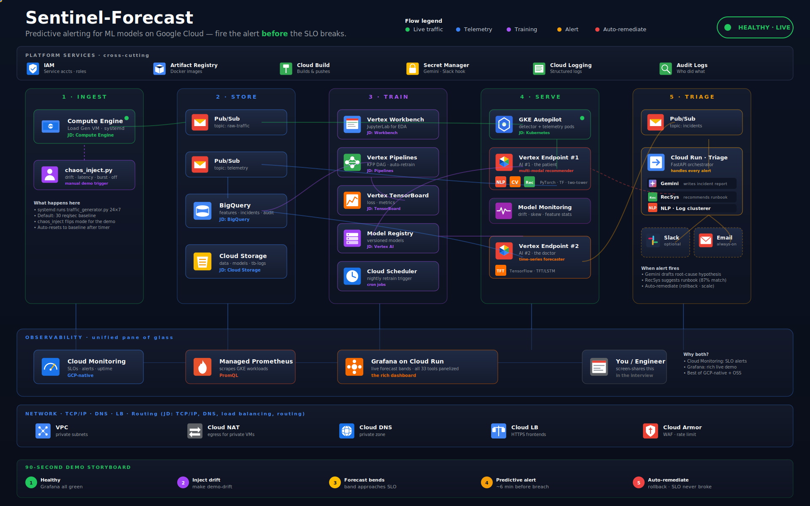
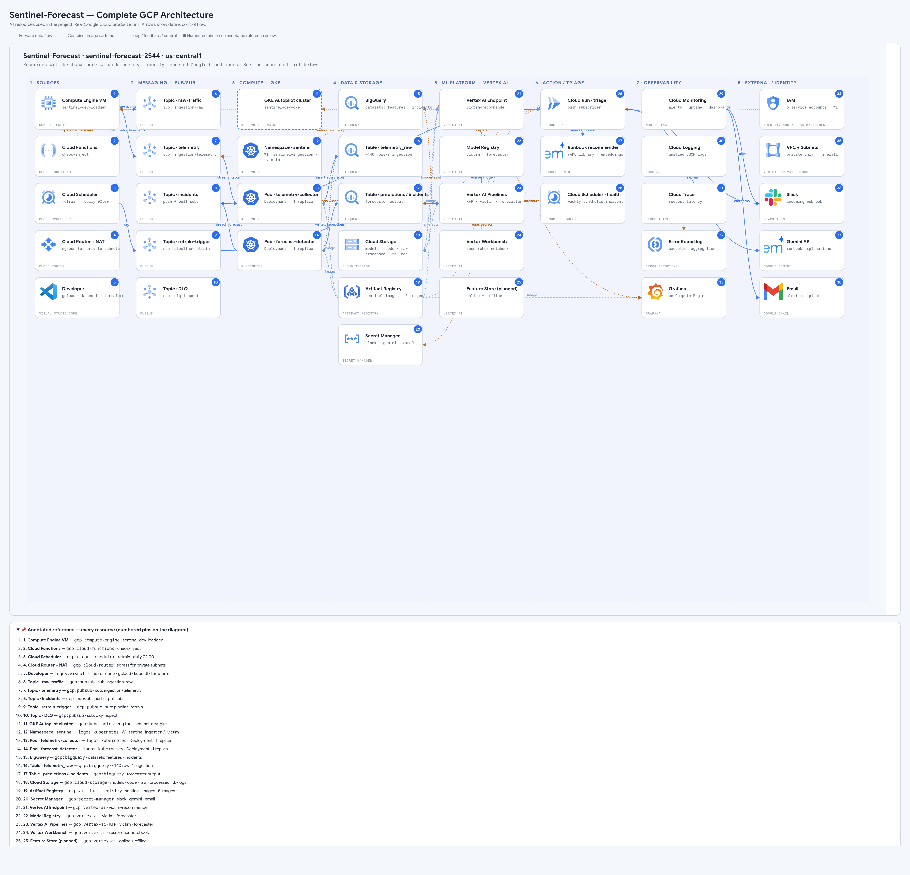
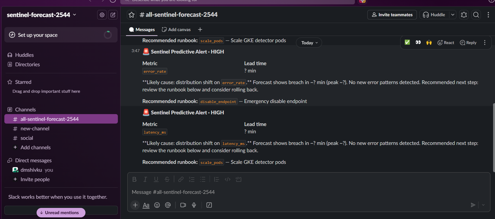
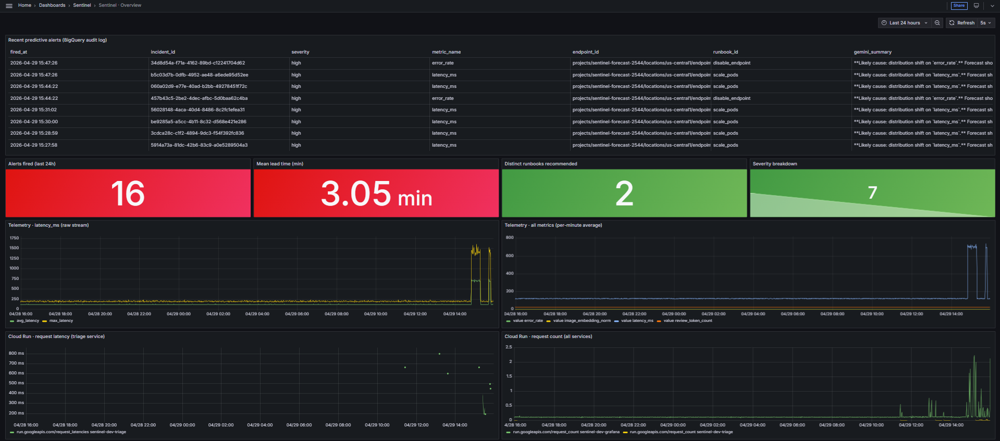

# Sentinel-Forecast

> **Predictive alerting for AI models on Google Cloud — fire the alert *before* the SLO breaks, not after.**

<p align="center">
  
</p>

<p align="center">
  <em>Live traffic flowing left → right. Healthy state shown above; failure state animates the alert path through Pub/Sub → Triage → Slack/Grafana.</em>
  <br/>
  <strong>👉 Open <a href="diagrams/architecture.svg"><code>diagrams/architecture.svg</code></a> directly in a browser to see the full animated experience.</strong>
</p>

A meta-MLOps platform that watches another ML model's vital signs in real time, **forecasts** the next two hours of those vitals using a TensorFlow time-series model, and triggers a **Gemini-powered triage workflow** before any customer is impacted. Built end-to-end on GCP with Terraform.

---

## Why this project exists

Production AI does not fail like normal software. It does not throw a 500 error — it just *quietly gets dumber* as the world drifts away from its training data. By the time today's monitoring tools alert ("conversion rate dropped"), the damage is already done.

**Sentinel-Forecast** is a weather forecaster for AI systems. It looks at the model's vitals *right now*, and tells you *"this model will breach its SLO in 47 minutes — here is why, and here is the runbook to fix it."*

---

## What's in the box

| | Item | Where |
|---|---|---|
| ✨ | Animated horizontal architecture SVG with real GCP icons | `diagrams/architecture.svg` |
| 📦 | One Terraform folder per tool, ordered as a DAG | `terraform/00-globals` → `18-grafana-dashboard` (19 folders) |
| 📝 | Every `.tf` and `.py` file has a WHAT / WHY / HOW header | Enforced via `tests/test_terraform_lint.py` |
| 🚀 | One-command deploy / pause / destroy | `scripts/bootstrap.sh` → `start.sh` → `stop.sh` → `destroy.sh` |
| ✅ | 5-layer smoke test after deploy | `scripts/smoke_test.sh` |
| 🔥 | Continuous load gen + manual chaos demo (5 modes) | systemd VM + `scripts/chaos_inject.py` |
| 🔔 | Slack alerts + email fallback | `scripts/setup_slack.sh` + `scripts/setup_email.sh` |
| 📊 | 4 rich Grafana dashboards + Cloud Monitoring SLOs | `src/dashboards/grafana/*.json` + `terraform/17-monitoring/` |
| 🧪 | pytest suite (17 tests, all passing) | `tests/` |
| 📖 | Console tour + hands-on test scenarios | `docs/CONSOLE_TOUR.md` + `docs/TEST_SCENARIOS.md` |

---

## Tech stack & GCP services used

A quick map from each tool / concept to where it lives in the repo, in case you want to jump straight to a specific implementation.

### ML / AI

| Tool | Where in the project |
|---|---|
| **Vertex AI Workbench** | `terraform/08-vertexai-workbench/` |
| **Vertex AI Pipelines** | `terraform/10-vertexai-pipelines/` + `src/pipelines/` |
| **Vertex AI Endpoints** | `terraform/11-vertexai-endpoints/` (AI #1) + `terraform/12-vertexai-forecast-endpoint/` (AI #2) |
| **Vertex AI TensorBoard** | `terraform/09-vertexai-tensorboard/` |
| **Vertex AI Model Monitoring** | `terraform/11-vertexai-endpoints/monitoring.tf` |
| **Gemini (generative AI)** | `src/triage/gemini_triage.py` |
| **TensorFlow / Keras** | `src/forecaster/temporal_forecaster.py`, `src/victim_model/vision_image_encoder.py` |
| **PyTorch** | `src/victim_model/nlp_review_encoder.py`, `src/victim_model/recommender.py` |
| **NLP (DistilBERT + log clustering)** | `src/victim_model/nlp_review_encoder.py` + `src/forecaster/log_clusterer.py` |
| **Computer Vision (MobileNetV3)** | `src/victim_model/vision_image_encoder.py` |
| **Recommendation systems** | Two-tower recommender `src/victim_model/recommender.py` + runbook recommender `src/runbook_recommender/recommender.py` |

### Platform / infra

| Tool | Where in the project |
|---|---|
| **Cloud Run** (serverless) | `terraform/15-cloudrun/` — triage + Grafana |
| **GKE Autopilot** | `terraform/13-gke/` |
| **Compute Engine** | `terraform/14-compute-engine/` — load-gen VM |
| **Pub/Sub** | `terraform/06-pubsub/` |
| **BigQuery** | `terraform/05-bigquery/` |
| **Cloud Storage** | `terraform/03-cloudstorage/` |
| **Artifact Registry** | `terraform/04-artifact-registry/` |
| **Cloud Build** | `docker/cloudbuild.yaml` (5 images, parallel) |
| **Cloud Scheduler** | `terraform/16-cloudscheduler/` |
| **Cloud Monitoring + SLOs** | `terraform/17-monitoring/` |
| **Secret Manager** | `terraform/07-secret-manager/` + `src/utils/secret_client.py` |
| **IAM (least privilege)** | `terraform/02-iam/` — 8 service accounts, scoped roles |
| **VPC / Cloud Armor / DNS** | `terraform/01-vpc/` + `terraform/01-vpc/armor.tf` |
| **Workload Identity (GKE)** | `terraform/02-iam/workload-identity.tf` + `terraform/13-gke/manifests.tf` |

---

## Architecture

<p align="center">
  
</p>

<p align="center"><em>Static high-resolution view — every Terraform-managed service, every IAM boundary, every data flow.</em></p>

For the **animated** version with live traffic particles and a healthy → alert state toggle, open <a href="diagrams/architecture.svg"><code>diagrams/architecture.svg</code></a> in a browser.

### Two AIs, working together

- **AI #1 — "the patient":** A multi-modal product recommender (PyTorch DistilBERT for review text + TF/Keras MobileNetV3 for product images + two-tower retrieval). Lives on Vertex AI Endpoint #1.
- **AI #2 — "the doctor":** A TensorFlow encoder-decoder LSTM (a lightweight stand-in for a Temporal Fusion Transformer; same training surface, faster to retrain on the demo budget) that forecasts AI #1's vitals 2 hours into the future. Lives on Vertex AI Endpoint #2.

When AI #2 predicts a future SLO breach, the **Cloud Run triage service** wakes up: Gemini writes the human-readable incident report, the runbook recommender suggests a fix, and auto-remediation rolls the model back — *before* any customer feels it.

---

## Quickstart

### Prerequisites
- A GCP project with billing enabled
- `gcloud` CLI installed and logged in (`gcloud auth login` + `gcloud auth application-default login`)
- `terraform >= 1.6`, `docker`, `python 3.11+`

### Deploy

```bash
# 1. Configure
cp .env.example .env
# edit .env to set GCP_PROJECT_ID, GCP_REGION, ENV_NAME

# 2. One-time: create the Terraform state bucket
./scripts/bootstrap.sh

# 3. Build everything (~25–35 min first run)
./scripts/start.sh

# 4. Verify
./scripts/smoke_test.sh

# 5. Run the demo (then `make demo-reset` when done)
make demo-drift
```

When `start.sh` finishes you will see:
- A **Grafana dashboard URL** (Cloud Run)
- A **Vertex Endpoint URL** for AI #1
- A **traffic generator status** (continuous baseline running on a VM)

### How `start.sh` builds container images

By default `start.sh` builds all 5 images **locally** with your Docker daemon (~5-10 min) and pushes them to Artifact Registry. This is faster and more reliable than Cloud Build, which is queue-starved on trial GCP accounts (often 30+ min wait).

| Mode | How to enable | When to use |
|---|---|---|
| **Local build** (default) | just run `./scripts/start.sh` | Recommended; needs Docker on the host |
| **Cloud Build** | `USE_CLOUD_BUILD=true ./scripts/start.sh` | Use when host has no Docker daemon (e.g. ephemeral CI) |
| **Skip build** | `SKIP_BUILD=true ./scripts/start.sh` | Re-applying terraform only after images already exist |

Single-image rebuild after a code change:

```bash
./scripts/build_local.sh forecaster   # rebuilds + pushes only the forecaster image
kubectl rollout restart deployment/forecast-detector -n sentinel
```

### What `start.sh` does end-to-end

1. **Terraform 00 → 07** (foundation: APIs, VPC, IAM, GCS, BigQuery, Pub/Sub, Secret Manager)
2. **Build + push 5 container images** (locally by default; Cloud Build if requested)
3. **Compile + upload Vertex AI pipelines** to the code bucket
4. **Upload `traffic_generator.py`** to the code bucket so the loadgen VM can fetch it
5. **Terraform 08 → 13** (Vertex AI Workbench, TensorBoard, Pipelines, Endpoints, GKE Autopilot)
6. **Wait for GKE RUNNING** + 30s for Workload Identity pool to register
7. **Re-apply `02-iam`** with `enable_workload_identity_bindings=true` (KSA→GSA bindings)
8. **Terraform 14 → 18** (Compute Engine loadgen, Cloud Run triage+grafana, Cloud Scheduler, Monitoring, Grafana dashboards)
9. **`./scripts/seed_models.sh`** — trains synthetic victim + forecaster models, registers victim in Vertex Model Registry, deploys to endpoint, applies the `forecast-detector` Deployment on GKE

### Pause / resume / fully destroy

```bash
./scripts/stop.sh        # cost-saver: stops the VM, scales GKE/Cloud Run to 0
./scripts/start.sh       # idempotent — brings everything back online
./scripts/destroy.sh     # full teardown — undeploys Vertex models, deletes everything,
                         # asks confirmation. Bills drop to $0.
```

---

## Project structure (overview)

```
Predictive-alerting-1/
├── diagrams/architecture.svg     # animated horizontal infra diagram
├── docs/                         # CONSOLE_TOUR.md + TEST_SCENARIOS.md
├── scripts/                      # start/stop/smoke/chaos
├── terraform/                    # 18 numbered folders (00 → 18)
├── src/                          # victim_model, forecaster, triage, ingestion, pipelines
├── docker/                       # Dockerfiles + cloudbuild.yaml
└── tests/                        # pytest
```

For the **fully expanded** structure with every file annotated, see the design notes in `docs/CONSOLE_TOUR.md`.

---

## Live demo — what it looks like in action

The screenshots below were captured during a real chaos-injection demo. Latency was injected into the recommender's serving path; within ~90 seconds the watcher caught the SLO breach, fired a Pub/Sub event, and the rest of the chain lit up automatically.

### Slack alert (human-in-the-loop)

<p align="center">
  
</p>

<p align="center"><em>Cloud Run triage service consumed the incident, called Gemini for a natural-language summary, picked the matching runbook, and posted to Slack. The on-call engineer gets full context — not a blank page.</em></p>

### Grafana dashboard (operations view)

<p align="center">
  
</p>

<p align="center"><em>Three panels in one pane: raw telemetry (BigQuery), forecaster predictions with confidence bands, and the live incidents feed. Same data the alert was raised from — for the operations team.</em></p>

---

## How to test

After `./scripts/start.sh` succeeds:

| # | Scenario | Command | What you should see |
|---|---|---|---|
| 1 | Healthy baseline | (already running) | Grafana all-green |
| 2 | Inject drift | `make demo-drift` | Forecast band bends, alert fires in ~5–15 min |
| 3 | Inject latency | `make demo-latency` | p99 forecast crosses SLO, alert fires |
| 4 | Burst traffic | `make demo-burst` | HPA scales GKE pods automatically |
| 5 | Smoke test | `make smoke` | 5/5 PASS across Pub/Sub, BQ, Vertex AI, Cloud Run, triage |
| 6 | Reset | `make demo-reset` | Traffic returns to baseline |
| 7 | Pytest suite | `make test` | 17/17 unit tests pass (config + chaos modes + SLO + RecSys + TF lint) |

For the full 5-scenario walkthrough, see `docs/TEST_SCENARIOS.md`. For a guided GCP console tour after deploy, see `docs/CONSOLE_TOUR.md`.

---

## Cost estimate

| State | Cost |
|---|---|
| Active demo (Compute VM + GKE Autopilot + Vertex endpoints + Cloud Run) | **~$10–15 / day** |
| Paused (`./scripts/stop.sh` — keeps data + IAM, stops compute) | **~$1–2 / day** |
| Fully destroyed (`terraform destroy` across all 19 folders) | **$0** |

Top cost drivers: Vertex AI Endpoint instances (~$5/day each), GKE Autopilot pods (~$3/day), Compute Engine VM (~$1/day). Everything else is pennies.

---

## Troubleshooting

See `docs/CONSOLE_TOUR.md` for per-tool console links and common issues. Common gotchas:

- **`PERMISSION_DENIED` on first apply** → run `gcloud auth application-default login`.
- **Vertex Endpoint 503 for ~60s after deploy** → models are warming up; this is normal.
- **No data in Grafana** → check Compute VM is in `baseline` mode (`make demo-reset`); also confirm the GKE `telemetry-collector` pod is running (`kubectl get pods -n sentinel`).
- **Slack messages not arriving** → Slack is optional; check `gcloud secrets versions list --secret=sentinel-dev-slack-webhook` exists. The triage Cloud Run service caches the webhook in-process — **after updating the secret, redeploy triage** so it re-reads the new value: `gcloud run services update sentinel-dev-triage --region=us-central1 --update-env-vars=BUMP=$(date +%s)`.
- **`forecast-detector` pod CrashLoops with `forecaster model not found in GCS`** → the seed step didn't finish. Re-run `./scripts/seed_models.sh` manually; it's idempotent.
- **`forecast-detector` pod gets `403 Permission denied` on BigQuery** → the Workload Identity binding for `sentinel-forecaster` KSA didn't apply. Re-run `ENABLE_WI_BINDINGS=true terraform -chdir=terraform/02-iam apply` and bounce the pod with `kubectl rollout restart deployment/forecast-detector -n sentinel`.
- **`forecast-detector` fires alerts every minute** → SLO threshold sits inside the LSTM noise floor. The default thresholds (`latency_ms=300`, `error_rate=0.02`) are production-realistic; if you tuned them lower for a demo, raise them back. Cooldown is `ALERT_COOLDOWN_SECONDS` env var (default 180s).
- **Pipeline run fails with "image not found"** → Cloud Build likely still in progress; wait for `gcloud builds list --ongoing` to be empty, then re-trigger via `gcloud scheduler jobs run sentinel-dev-forecaster-retrain --location=$GCP_REGION`.

---

## Credits

Built as a personal portfolio / learning project to explore end-to-end MLOps on Google Cloud — Vertex AI, GKE Autopilot, Cloud Run, Pub/Sub, BigQuery, Gemini, and the rest of the stack stitched together with Terraform. All Google Cloud icons in `diagrams/architecture.svg` are from the official `cloud.google.com/icons` set.
